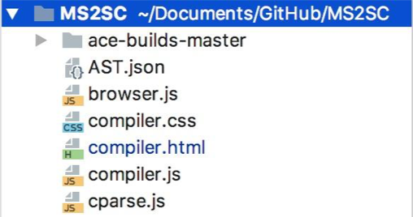
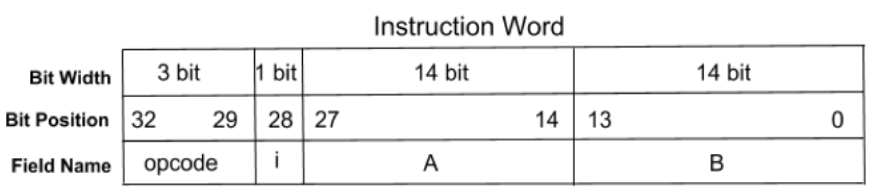
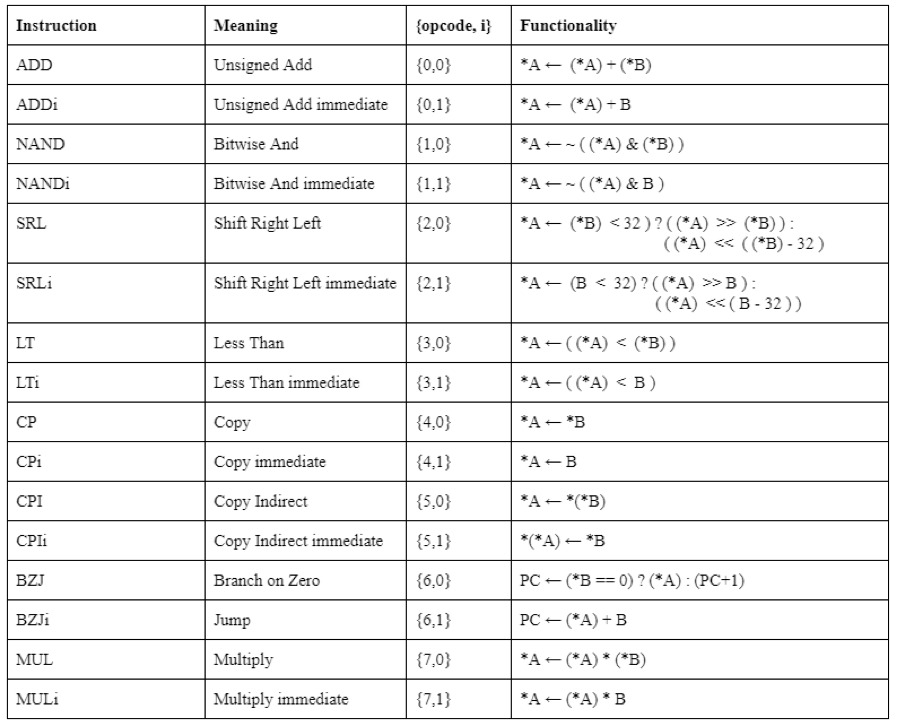
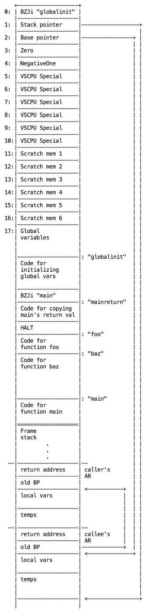
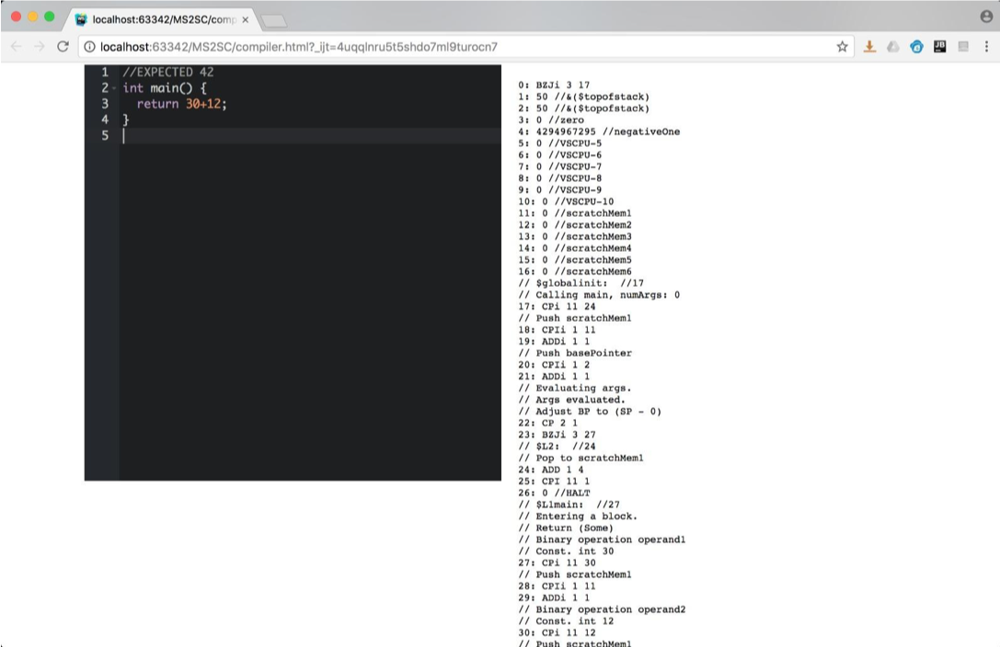

<p align="center"><b>ÖZYEĞİN UNIVERSITY</b></p>
<p align="center"><b>FACULTY OF ENGINEERING</b></p>
<p align="center"><b>DEPARTMENT OF COMPUTER SCIENCE</b></p>
<br>
<p align="center"><b>2018 Summer</b></p>
<p align="center"><b>SENIOR PROJECT REPORT</b></p>
<p align="center"><b>Online Compiler</b></p>
<br>
<p align="center">By</p>
<p align="center"><b>Begüm DEMİREL</b></p>
<p align="center"><b>Yiğit POLAT</b></p>


# Abstract

_This report addresses the problem of lack of a compiler from  high-level language to VerySimpleCPU. VerySimpleCPU is a project of our university professor Assoc. Prof. Dr. Fatih Uğurdağ, which is a simple version of a CPU. Our web-based compiler takes a C code and prints the related assembly code which would be carried out by VerySimpleCPU, on the right side of the screen. The project is developed in JavaScript and we have used a previously developed parser for parsing the C code. Our reference for this project is a compiler written in OCaml for the same purpose. We have tested our system with the test files written for the referenced project and compared the results from both compilers. The compiler will be further developed and modified to handle several cases which are not handled in current version._

# Contents

1. [INTRODUCTION](#1-INTRODUCTION)
2. [BACKGROUND](#2-BACKGROUND)
3. [PROBLEM STATEMENT](#3-PROBLEM-STATEMENT)
4. [SOLUTION APPROACH](#4-SOLUTION-APPROACH)
5. [RESULTS AND DISCUSSION](#5-RESULTS-AND-DISCUSSION)
6. [RELATED WORK](#5-RELATED-WORK)
7. [CONCLUSION AND FUTURE WORK](#5-CONCLUSION-AND-FUTURE-WORK)

# 1. INTRODUCTION

A CPU (Central Processing Unit) is an electronic component of a computer which performs processing by carrying out instructions of a program such as basic arithmetic, logical, control and input/output (I/O) operations. Often referred to as the "brain" of the computer, a CPU handles the instructions it receives from the hardware and software. A group of commands which is provided to the processor is called an instruction set. An example of an instruction set can be given as x86 instruction set, which is common among many processor.

A compiler is a program that processes statements written in a specific programming language and converts it into a machine language, assembly in our project, so that the computer's processor would recognizes it. As a first step, a compiler parses the input statements syntactically and after successive parsing, builds the output code as machine language.

VerySimpleCPU (will be referred as VSCPU in the rest of this report), is a simple CPU, as can be inferred from the name, and can be defined as a "calculator" which recognizes, unlike other CPUs, only seven instructions that are used for arithmetic calculations. These seven instructions can be used to write nearly every program in a way that would be recognized by VSCPU. The seven instructions are written in assembly code and will be explained in detail in the following sections.

The aim of our project is to develop a compiler which would take a C code as input and make it recognizable by VSCPU, by turning it into assembly code representation of the program. The system will work online, and the C code that is entered in the editor on the right side of the window will be represented as assembly code on the left. This assembly code would be understandable by VSCPU and will work for the same purpose as the C code.

This report is a detailed explanation of our compiler from C to VSCPU. The set of tools, techniques and technologies that are used in this project can be found in the following section. Third Section introduces the project scope, the engineering problems that we solved, any assumptions and constraints that were faced while developing this project, and all the functional and non-functional requirements of the project. In the Section 4, the project is described in detail, with the tools and techniques that were used, and technical, operational and financial feasibility of our implementation. The knowledge and skill set that were used in this project and the engineering standards that were took into consideration in the development process are also introduced in this section. Section 5 discusses the results that are achieved so far and the current status of the project, as well as the limitations we have faced. Section 6 explains the related works and their comparison with our project. In the Seventh Section given a summary of our achievements so far, the expected social and economic impacts of our work, as well as its effect on global and societal health and environment. The safety and security issues and legal consequences are discussed in this section. This section also provides an insight of our future work and how the project can be extended.

# 2. BACKGROUND

In this section, you may find the explanations of tools and techniques that are used in this project and why they were chosen.

**JavaScript:** JavaScript is a high-level, interpreted programming language. The back-end development of the project is done using JavaScript. JavaScript was chosen for feasibility reasons since it is an essential part of web applications.

**WebStorm IDE:** WebStorm is an editor for JavaScript, alongside with HTML and CSS. WebStorm IDE is used for the development of this project due to its user friendlyenvironment and easy GitHub integration.

**HTML:** HyperText Markup Language (HTML) is used for the web development part of the project. HTML is a markup language used to create web pages and web applications, alongside with CSS and JavaScript.

**CSS:** Cascading Style Sheets (CSS) is a style sheet language used for describing the presentation of a document written in a markup language like HTML. We used CSS to format and style the online page of the application.

**JSON:** JavaScript Object Notation (JSON) is a lightweight data-interchange format. It is easy for humans to read and write and it is easy for machines to parse and generate. In our project we take the parsed C code as a JSON file for our compiler to read through, therefore the JSON file serves the purpose of an abstract syntax tree in this project.

**GitHub:** GitHub is an online platform for version control using Git. We chose GitHub for version control due to its easy to use interface and WebStorm integration. The project is open to public and accessible for everyone.

**Assembly:** Assembly is a low-level, machine language which consists of some instructions and numbers. Since VSCPU works with assembly language, our aim was to express a C code in terms of these instructions.

**C Language:** C is a mid-level language which is more widely-known and used than assembly language. Our main input in this project is C language which is parsed and compiled into assembly instructions.

# 3. Problem Statement

## Project Scope

This is a new project, aiming to develop a web-based compiler and debugger that would take a C code as input and transform it into assembly code so that it would be applicable to VSCPU. The input of the program is a C code which is parsed into a JSON file. This JSON file will be used as an abstract syntax tree for the compiler. The output of the program is a set of assembly instructions which would be recognized by VSCPU. This assembly output will also be simulated with the integrated simulator to show the specific addresses each data is stored.

## Engineering Problem

The engineering problem we have faced is that assembly language that the VSCPU works with is a relatively unknown and low-level language, and many developers are unable to work with VSCPU due to this problem. Our project, an online compiler from C to VSCPU offers a solution to this problem by allowing developers to work with VSCPU without having to interact with assembly language. Developers can easily run a VSCPU by writing the desired program in C, a high-level and widely-known language. This project was offered by our supervisor.

## Assumptions

There are several assumptions for this project.

1. We assume that Ace library used for online application design will continue to support our program.
2. We assume the user knows programming in C.
3. We assume no new instructions will be defined for VSCPU.

## Constraints

There are several constraints for this project, listed below.

1. The application requires internet connection since it is web-based.
2. The project is to be completed until 7thAugust 2018 in order to present a demo.

# 4. Solution Approach

The aim of our project was to develop a web-based compiler from C to VSCPU, therefore our project consist of JavaScript, HTML and CSS files. We have developed our project on WebStorm IDE and used GitHub for version control as stated in Section 2. The main input of our project is C code snippets. This C code is parsed by an online parser called _cparse_, in which later on we have integrated in our project. The output of this parser is a JSON file, which we use as an abstract syntax tree.

A compiler is a program which takes a code written in a specific language and turns it into machine language, which would be understandable by the processor. In our project, the input language of our compiler is C, and the final product is assembly code consisting of seven instructions, that would be carried out by VSCPU. If needed, these instructions can also be simulated to show the stored data in each address of the memory.

The expected output of our program is assembly code which would be recognized by VerySimpleCPU. VSCPU is a CPU, which is said to be simple due to the reason it works with only seven instructions of assembly language. Assembly language consists of many instructions that would be recognized by CPU, and any program can be expressed in assembly language. VSCPU on the other hand, recognizes a very few arithmetic instructions. These instructions, alongside with their explanations, are given below.  There is an option of adding  an 8th instruction if needed. For the purposes of this project, we used MUL as the eighth instruction. Detailed explanations can be found in Appendix.

1. **ADD -** Adds the values in the locations given as input and writes into the first location.
2. **NAND -** Bitwise AND operation.
3. **SRL -** Shift right or left operation.
4. **LT -** Less than operator compares the values in the given two locations.
5. **CP -** Copies the values in one location into the other location.
6. **CPI -** Copy indirect operation.
7. **BZJ -** Branch on zero operation to jump to a location based on a condition.

Our project consists of five files in total, including the open source _cparse.js_ file that we have included in our project to be able to parse the input C code and write it into a JSON file. The file which includes our main function is _compiler.js_, it includes all the necessary functions and data structure declarations. _browser.js_, _compiler.html_ and _compiler.css_ are the necessary files to build the online application. Class hierarchy can be seen in Figure 1.

<p align="center"></p>
<p align="center"><b>Figure 1:</b> Class hierarchy</p>
<br>

The JSON file we have used as an abstract syntax tree for our compiler is the output file of the parser. The JSON file contains the parsed information of the input C code. Our compiler first takes this file as an input and according to the declared type of an object in the JSON file, sends the object to the applicable method as a parameter. Object is first sent to a method in which it is decided if the object is a declaration or statement. In case it is a declaration, then it is decided if it is a function declaration or global variable declaration. If it is a statement, on the other hand, it is decided if it is a for statement, while statement, if statement, expression statement or return statement. In case it is an expression statement, the object is then sent to a _decideExpression_ method in order to print the specific assembly code depending on the type of expression. Otherwise, the necessary assembly code regarding the statement is added to a string list, which is later to be printed on the screen. A pseudocode for the process of recursively processing a statement is given below.

```pseudo
declarationOrStatement(input) {
    if input is an instance of function declaration then add to environment
    else decideStatement(input)

}
```

```pseudo
decideStatement(input) {
    if input is an instance of if statement or for statement or while statement or return statement then do
        expression = expression part of input
        declarationOrStatement(expression)
        write the related assembly code for each case
    else if input is an instance of expression statement then
        decideExpression(input)

}
```

```pseudo
decideExpression(input) {
    if input is an instance of literal or identifier or binary expression or suffix expression or prefix expression or cast expression or call expression or index expression do
        expression = expression part of input
        declarationOrStatement(expression)
        write the related assembly code for each case
    else return error

}
```

The declared variables in the C code are added to the environment which is held as a Linked List of HashTable in our project. For every code block, a new HashMap is added to the beginning of the list. The variables that are declared in each block are added to the HashMap specific to that block. When a variable is added as a key, an index is assigned as its value. The index is zero for the first variable in the HashTable and increased after every addition to the environment. When a variable is to be used in a statement or expression, the variable is allocated with the _lookUp_ method. The method searches the Linked List starting from the head. If a variable is not found in a node, which is a HashMap, the search continues with the next node. If the variable is found in the HashTable, then the index related to that variable is added to the base pointer when writing the address of the variable in the assembly instruction. When the function is read through, the HashTable related to the function is deleted from the list.

Linked List and HashTable are not embedded data structures in JavaScript, therefore we had to define them as functions. Since JavaScript is not fully object oriented language, we had to define the methods related to these data structures as prototypes, in an object oriented manner. Prototype is basically a pointer to an object which has a constructor property by default. This property points back to the function which accesses it.

The modified version of the project handles and compiles the function calls. A function environment is created to keep track of the called functions. This environment is a Hash Table which holds pairs of function name and function arguments. The arguments are also held as a Hash Table. There is also a list to hold the names and locations of the functions that are called but not defined yet. This list enables us to modify the jump address when a function is defined after it was called.  To give out the correct assembly code for function call, we first modified the function declaration part of our model. When a function is declared, the program first checks if the declared function is called before it was declared. If it was, then the jump address of the caller function is modified to the beginning of the callie function.

If a function is being called, a new Hash Table for the function arguments are created. This Hash Table, alongside with the function name is added to the function environment. Then each argument that is given to the function is added to the Hash Table with an index number, which is increased by one with every new argument. If the jump location of the function, which is found from the function location list, is undefined, then the name of the function, along with the address that it was called is added to the undefined function list. As explained before, the jump location is modified when the function is defined, with the help of undefined function list.

The string list that would be printed on screen, which can be said to be a stack representation, is initialized with a jump to global variable initializations, stack pointer, base pointer and several scratch memories for future usage. These scratch memories are free spaces that can be used to move data. The stack grows and shrinks according to the function calls. The stack pointer points to the top of stack. When a function call is done, a stack frame which is called a function activation record is added to the end of the stack. A function activation record stores the values return address, old base pointer and local variables. A base pointer points to the old base pointer of the current function. Old base pointer stores the address of previous activation record where the local variables start. When the function returns, base pointer returns to its old location. The return address stores the address of where the function should return. A visual representation of the stack can be found in the Appendix.

The online application consists of an editor in which the user can enter the C code on the left pane and a text area which shows the relevant assembly code on the middle pane. The text in the middle is updated after every addition to the editor. On the right panel, the simulation of the assembly code is shown. This simulation shows the data stored in each address and the changes in these addresses aThe web page is developed using HTML and CSS, and we have used the Ace library to add the editor to the screen.

## Advantages

1. Easily run VerySimpleCPU with C code.
2. See the state of the stack by running the simulation.

## Disadvantages

1. Needs internet connection.
2. Only applicable for VerySimpleCPU.
3. Performance problems may occur with long code blocks.

## Tools and Techniques

We have developed this project using JavaScript and HTML. Back-end development is done with JavaScript on WebStorm IDE. We used GitHub for version control due to its user-friendly interface and WebStorm integration. The input of the program is a JSON file which is obtained from an open-source parser that which is integrated in our project later on.

A VerySimpleCPU simulator is integrated in the project to simulate the assembly code and show the data of each memory address.

## Technical, Operational and Financial Feasibility

### Technical Feasibility

We have used HTML, CSS, and JavaScript in order to develop this compiler. In the future, depending on the new features on these programming languages, we might need to modify our code.

### Operational Feasibility

Our system works accurately with the given correct input and produce adequate output in short response time.

### Financial Feasibility

All the tools that we used in this project (GitHub, WebStorm) are open source. However, in the future we have to pay for the web host.

## Knowledge and Skill Set

All the courses we took at Özyeğin University have contributed our development in several ways. The following courses are the ones that we have especially used our acquired knowledge in this project:

**CS102 - Object Oriented Programming:** This course allowed us to define HashMap and Linked List in JavaScript in an object oriented manner.

**CS240 - Computer Architecture:** This course provided us the necessary knowledge about VerySimpleCPU and assembly, which are the bases of our project.

**CS321 - Programming Languages:** Knowledge of OCaml acquired from this course helped us to understand and analyze a related work that was a main reference point for our project.

## Engineering Standards

The following are the engineering standards we took into consideration while developing this project:

1. HTTP (HyperText Transfer Protocol)
2. PSR-1 (Basic Coding Standard)
3. PSR-2 (Coding Style Guide)
4. Airbnb JavaScript Style Guide

# 5. Results and Discussion

The final version of our project can successfully convert the input C program into assembly code. As expected, the C code entered in the editor on the left pane of the page is expressed in terms of assembly instructions which would be recognized by VSCPU, in the middle pane. On the left panel can be seen the simulation of the assembly code. The output of this simulation shows the stored data in each address of the memory and the changes in these memory addresses after every line of assembly code. We have tested our system with test cases taken from a project called ClangAction, which is a compiler as a clang tool. We have compared our test results with the results from the referenced compiler. The results are also checked to be correct by running the simulation and examining the data in each memory address. The details of the referenced project are explained in the Related Works Section. In the following subsection can be found the details of  the test environment and the results of each test.

## Test Environment & Simulation

We have built a website with an editor at the left pane and the assembly code output in the middle. On the right, there is the simulator to run the assembly code. This is our final version of the project ready for the use. We have used this frame in order to test the system to see if it works correctly. We have used the test cases from the referenced compiler project. In the end of the tests we came up with a system that works flawless for the functionality that we developed until now.

## Summary of Test Cases

We have tested 206 number of test cases in total. We compared the results from our system with the results from ClangAction compiler. We have also ran the simulation with the assembly input to check the stored data in each address. We have observed that all the tests passed successfully and gave the right assembly output to be simulated. Due to the reason that our integrated parser does not parse "else if" statements, the "else if" test cases were changed to "if" statement in an "else" statement.

- Number of Test Cases = 206
- Correct Number of Tests = 206

# 6. Related Work

A related work to our project is a compiler from C to VerySimpleCPU which was written in OCaml. It is an prototypical project of Dr. Barış Aktemur and the project is our main reference point. In addition to the compiler, the project includes the parser and lexer. Since the parser of the project is different from ours, we had to make changes on reading and classifying the input from the parser. The compiler runs from the command prompt and the C file name is given as a parameter to the executable file. The compiled version of the C file can be seen on the command prompt. Although compiler written in OCaml supports most of the features of C and successfully compiled C files, there are some missing parts of the project. One of them is that the compiler does not convert division operations into assembly, due to the division by zero problem. Another case in which compiler does not work correctly is for loops. The compiler runs successfully only when the incrementation in the for statement is done with a suffix expression.

Another reference point for our project is the ClangAction compiler. This project is again carried out by Dr. Barış Aktemur. It is a syntax-directed compiler from C to VerySimpleCPU. It is written as a clang frontend action. The produced output is VerySimpleCPU assembly code in ASCII format. Just as in the OCaml project, the compiler is run from the command prompt.

# 7. Conclusion and Future Work

The final version of our project for this semester is successful in terms of reading through a C code, printing the equivalent assembly code on the screen, and giving the output of the simulation that runs the assembly code. The missing parts of the compiler from last term are implemented and tested. The compiler is improved to recognize and compile break and continue statements, arrays and pointers. The function call compilation is modified and mistakes in the assembly code are fixed. The simulator is integrated to run the assembly code. The compiler successfully passes the tests and the simulation gives the correct output.

In the future, we are planning to improve the program by using our resources at IBM and integrating the compiler with IBM Cloud.

## Economic and Social Impact

The compiler can be sold as a toolkit for users who would like to easily program a VerySimpleCPU. Currently there is no cost for developing the compiler and debugger. If IBM Cloud is used as a server to improve the compiler, there may be costs in the future. There is no social effect of this project in its current state.

## Effects

### Health

There is not any health impact of this project.

### Impact on Environment

Since this is a software project, there is no impact on the environment.

### Security

The system is secure in terms of user security since there is no usage of personal information in the system. There is no physical security risk or constraint.

### Manufacturability

The system is easily manufacturable and commerciable because of its software nature. It can be adapted to various languages, but our project will remain in the constraints of C and assembly language.

### Sustainability

This project is sustainable since it can be developed further by extending type checking and/or improving  user interface.

# 8. Acknowledgements

We would like to thank our supervisor Furkan Kıraç for all his help and support in this semester. We would also like to thank all our professors in Computer Sciences Department.

# References

  1. Sestoft, P., & Hallenberg, N. (2017). _Programming language concepts_. Cham, Switzerland: Springer.
  2. C. Chisolm and J. C. Lisonbee, &quot;ATLAS compiler development,&quot; _1999 IEEE AUTOTESTCON Proceedings (Cat. No.99CH36323)_, San Antonio, TX, 1999, pp. 111-119.
  3. [http://srl.ozyegin.edu.tr/cparse/](http://srl.ozyegin.edu.tr/cparse/)
  4. [https://github.com/MC2SC/Compiler/tree/master/OCaml](https://github.com/MC2SC/Compiler/tree/master/OCaml)
  5. [cpu.tc/simulator\_py](http://www.cpu.tc/simulator_py)

# Appendix
<p align="center"></p>
<p align="center"><b>Figure 1:</b> 32 bit Instruction Word (IW) of SimpleCPU.</p>
<br>

<p align="center"></p>
<p align="center"><b>Table 1:</b> Explanations of VerySimpleCPU instructions.</p>
<br>

<p align="center"></p>
<p align="center"><b>Figure 2:</b> Visual representation of stack.</p>
<br>

<p align="center"></p>
<p align="center"><b>Figure 3:</b>Screenshot of online application run with a basic C code snippet.k</p>
